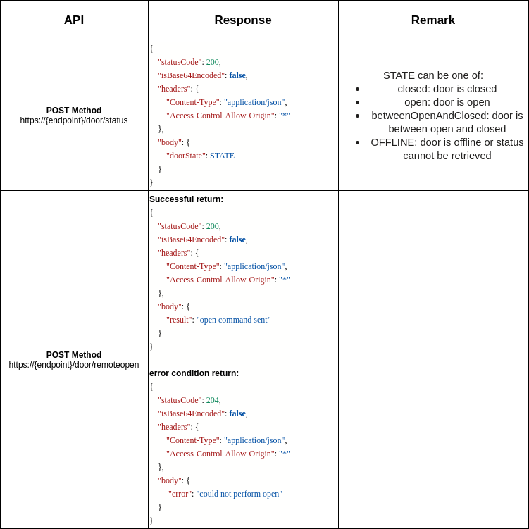

## **What Is This?**

A mock RMF Door Adapter.

## **Table of Contents**

1. [System Requirement](#system-requirements)
2. [General Working Principle](#general-working-principle)
3. [Package Overview](#package-overview)
    
    3a. [Directory Structure](#directory-structure)

4. [Usage](#usage)
5. [More Detail Reference](#more-detail-reference)


## **System Requirements**

The following software needs the below mentioned setup:
* <a href="https://docs.ros.org/en/humble/Installation.html">ROS 2 Humble</a>
* Robotics Middleware Framework (RMF) - <a href = "https://github.com/open-rmf/rmf"> RMF installation instruction</a>


## **General Working Principle**

* The door adapter is in charge of publishing its state and receiving commands over ROS 2
* The door adapter will keep publishing `/door_states` in 1 Hz
* The door adapter will assume the door status is closed when there is not door_request to the door adapter from `/adapter_door_requests`
* The door adapter will only being triggered to check door status and request door to open when it is being called by `/adapter_door_requests`

### **Published Topics**

The messages and topics used by rmf door adapter:

Publish:
*  Topic `/door_states` (message types: `rmf_door_msgs/DoorState`): topic that describes the status of the door and is published by door adapter 

Subscribe:
*  Topic `/adapter_door_requests` (message types: `rmf_door_msgs/DoorRequest`): topic that that is request by the rmf fleet adapter

The overview flow could be seen below:


## **Package Overview**

This is the general overview of the structure of this Library, and the listed files are described.

### **Directory Structure**
Below is the directory structure of the validation package, including the general function of certain scripts.

    |--door_adapter_template
        |-- doc                                 #document file
        |-- door_adapter                        #source file of the rmf door node
            |-- __init__.py
            |-- door_adapter.py                 #door node direct commnuicate with RMF and doorclientAPI
            |-- DoorExampleClientAPI.py         # Example of Door Client Example in REST method, where user will need to modify according to the door REST API Server
            |-- mock_door_server.py             # a mock door server
        |-- resource
        |-- test
        |-- config.yaml                         #configuration file
        |-- package.xml
        |-- setup.cfg
        |-- setup.py
        |-- README.md                   #contains installation and build/usage instruction
        
           
The sub file structure could be seen inside the packages.

## **Usage**

Certain Assumption is made for this door adapter template:
- The communication protocol for door node to the physical door controller is through [REST](https://searchapparchitecture.techtarget.com/definition/RESTful-API) API
- The expected response from API as below:
    
- Assume API doesn't have close door API

if the user's door condition is same as above, user can directly edit the parameter of `config.yaml` file as below:

```yaml
door:
    name: "example_door1"                               # input the door name will display and called by rmf
    api_endpoint: "https://door_endpoint_example/"      # API endpoint that would required to get from the API vendor/provider
    header_key: "example_key"                           # depend of header key and value required by door API server
    header_value: "example_header_value"                # depend of header key and value required by door API server
    door_id: "example_door_id"                          # depend of header key and value required by door API server
```

### **Build** :hammer:

Run the commands below to build `door_adapter_mock` in Docker:

1\. Build `door_adapter_mock`:

```bash
cd $HOME
```

```bash
git clone https://github.com/cardboardcode/door_adapter_template --branch feature/door_adapter_mock --depth 1 --single-branch
```

```bash
cd door_adapter_template
```

```bash
docker build -t door_adapter_mock:humble .
```

### **Run**

1\.. Run `door_adapter_mock`:

```bash
docker run -it --rm \
    --name door_adapter_mock_c \
    --network host \
    -v /dev/shm:/dev/shm \
    -v ./door_adapter_mock/configs/config.yaml:/door_adapter_mock_ws/src/door_adapter_mock/configs/config.yaml \
door_adapter_mock:humble /bin/bash -c \
"source /ros_entrypoint.sh && ros2 launch door_adapter_mock run.launch.xml config_file:=/door_adapter_mock_ws/src/door_adapter_mock/configs/config.yaml"
```

### **Verify**

```bash

```


## **References**

- https://osrf.github.io/ros2multirobotbook/integration_doors.html
- https://docs.python-requests.org/en/master/

[Back To Top of Page](#table-of-contents)