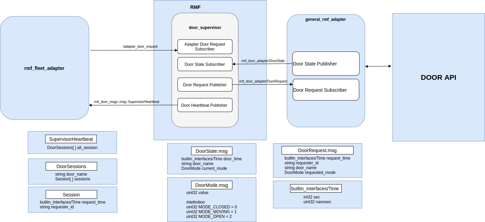

[](https://github.com/cardboardcode/door_adapter_template/actions/workflows/industrial_ci_action.yml)
[](https://opensource.org/licenses/Apache-2.0)


## **What Is This?**

A mock RMF Door Adapter that simulates the behaviour of a real door without the need to rely on external vendor-specific APIs.

## **Table of Contents**

1. [System Requirement](#system-requirements)
2. [General Working Principle](#general-working-principle)
3. [Package Overview](#package-overview)
    
    3a. [Directory Structure](#directory-structure)

4. [Usage](#usage)
5. [More Detail Reference](#more-detail-reference)


## **Dependencies**

The following software needs the below mentioned setup:
* <a href="https://docs.ros.org/en/humble/Installation.html">ROS 2 Humble</a>
* Robotics Middleware Framework (RMF) - <a href = "https://github.com/open-rmf/rmf"> RMF installation instruction</a>


## **General Working Principle**

* The door adapter is in charge of publishing its state and receiving commands over ROS 2
* The door adapter will keep publishing `/door_states` in 1 Hz
* The door adapter will assume the door status is closed when there is not door_request to the door adapter from `/adapter_door_requests`
* The door adapter will only being triggered to check door status and request door to open when it is being called by `/adapter_door_requests`

### **Published Topics**

The messages and topics used by rmf door adapter:

Publish:
*  Topic `/door_states` (message types: `rmf_door_msgs/DoorState`): topic that describes the status of the door and is published by door adapter 

Subscribe:
*  Topic `/adapter_door_requests` (message types: `rmf_door_msgs/DoorRequest`): topic that that is request by the rmf fleet adapter

The overview flow could be seen below:




## **Package Overview**

This is the general overview of the structure of `door_adapter_mock` ROS 2 package, and the listed files are described.

### **Directory Structure**
Below is the directory structure of the validation package, including the general function of certain scripts.

    |--door_adapter_mock
        |-- doc                                 #document file
        |-- door_adapter_mock                        #source file of the rmf door node
            |-- __init__.py
            |-- door_adapter.py                 #door node direct commnuicate with RMF and doorclientAPI
            |-- DoorExampleClientAPI.py         # Example of Door Client Example in REST method, where user will need to modify according to the door REST API Server
            |-- mock_door_server.py             # a mock door server
        |-- resource
        |-- test
        |-- config.yaml                         #configuration file
        |-- package.xml
        |-- setup.cfg
        |-- setup.py
        |-- README.md                   #contains installation and build/usage instruction
        
           
The sub file structure could be seen inside the packages.

### **Build** :hammer:

Run the commands below to build `door_adapter_mock` in Docker:

1\. Build `door_adapter_mock`:

```bash
cd $HOME
```

```bash
git clone https://github.com/cardboardcode/door_adapter_template --branch feature/door_adapter_mock --depth 1 --single-branch
```

```bash
cd door_adapter_template
```

```bash
docker build -t door_adapter_mock:humble .
```

### **Run**

1\.. Run `door_adapter_mock`:

```bash
docker run -it --rm \
    --name door_adapter_mock_c \
    --network host \
    -v /dev/shm:/dev/shm \
    -v ./door_adapter_mock/configs/config.yaml:/door_adapter_mock_ws/src/door_adapter_mock/configs/config.yaml \
door_adapter_mock:humble /bin/bash -c \
"source /ros_entrypoint.sh && ros2 launch door_adapter_mock run.launch.xml config_file:=/door_adapter_mock_ws/src/door_adapter_mock/configs/config.yaml"
```

### **Verify**

Upon running the command above, you should see an output similar to what is shown below:

```bash
[INFO] [launch]: All log files can be found below /root/.ros/log/2024-10-23-12-28-14-574052-rosi-0-1
[INFO] [launch]: Default logging verbosity is set to INFO
[INFO] [mock_door_server-1]: process started with pid [59]
[INFO] [door_adapter_mock_node-2]: process started with pid [61]
[mock_door_server-1] [door_obj_array] door_id = door_1
[mock_door_server-1] [door_obj_array] door_id = door_2
[mock_door_server-1]  * Serving Flask app 'door_adapter_mock.mock_door_server'
[mock_door_server-1]  * Debug mode: on
[mock_door_server-1] WARNING: This is a development server. Do not use it in a production deployment. Use a production WSGI server instead.
[mock_door_server-1]  * Running on http://127.0.0.1:8888
[mock_door_server-1] Press CTRL+C to quit
[mock_door_server-1]  * Restarting with stat
[door_adapter_mock_node-2] [INFO] [1729686494.992788679] [door_adapter]: Starting door adapter...
[mock_door_server-1]  * Debugger is active!
[mock_door_server-1]  * Debugger PIN: 556-308-017
[mock_door_server-1] 127.0.0.1 - - [23/Oct/2024 12:28:15] "POST /system/ping HTTP/1.1" 200 -
[mock_door_server-1] 127.0.0.1 - - [23/Oct/2024 12:28:16] "POST /door/door_1/status HTTP/1.1" 200 -
[door_adapter_mock_node-2] [INFO] [1729686496.143892656] [door_adapter]: DoorState = DoorMode.MODE_CLOSED
[mock_door_server-1] 127.0.0.1 - - [23/Oct/2024 12:28:16] "POST /door/door_2/status HTTP/1.1" 200 -
[door_adapter_mock_node-2] [INFO] [1729686496.146284578] [door_adapter]: DoorState = DoorMode.MODE_CLOSED
[mock_door_server-1] 127.0.0.1 - - [23/Oct/2024 12:28:17] "POST /door/door_1/status HTTP/1.1" 200 -
[door_adapter_mock_node-2] [INFO] [1729686497.144141635] [door_adapter]: DoorState = DoorMode.MODE_CLOSED

```


## **References**

- https://osrf.github.io/ros2multirobotbook/integration_doors.html
- https://docs.python-requests.org/en/master/

[Back To Top of Page](#table-of-contents)